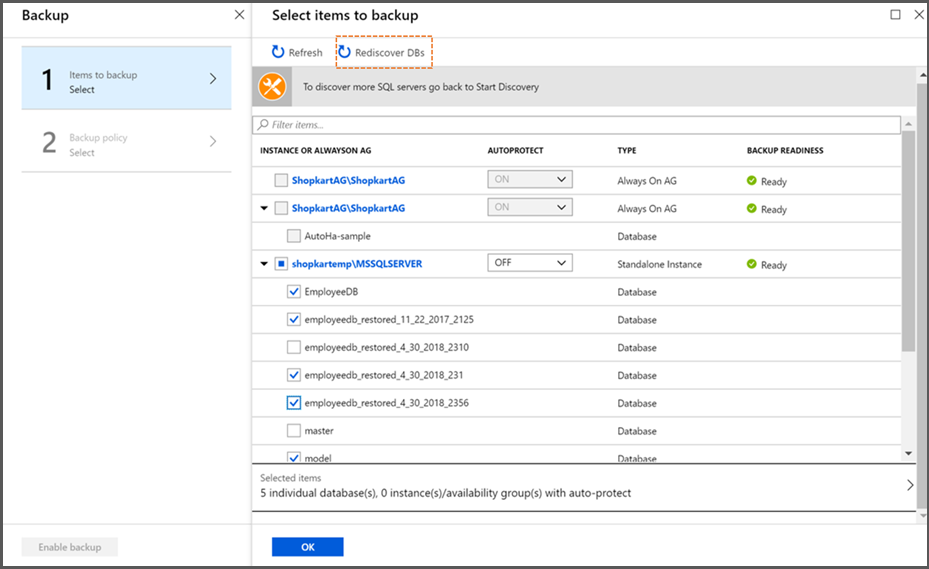

# FAQ about SQL Server databases that are running on an Azure VM backup

This article answers common questions about backing up SQL Server databases that run on Azure virtual machines (VMs) and that use the [Azure Backup](backup-overview.md) service.

> [!NOTE]
> This feature is currently in public preview.

## Can I throttle the backup speed?

Yes. You can throttle the rate at which the backup policy runs to minimize the impact on a SQL Server instance. To change the setting:
1. On the SQL Server instance, in the *C:\Program Files\Azure Workload Backup\bin* folder, create the *ExtensionSettingsOverrides.json* file.
2. In the *ExtensionSettingsOverrides.json* file, change the **DefaultBackupTasksThreshold** setting to a lower value (for example, 5).  
  ` {"DefaultBackupTasksThreshold": 5}`

3. Save your changes and close the file.
4. On the SQL Server instance, open **Task Manager**. Restart the **AzureWLBackupCoordinatorSvc** service.

## Can I run a full backup from a secondary replica?
No. This feature isn't supported.

## Do successful backup jobs create alerts?

No. Successful backup jobs don't generate alerts. Alerts are sent only for backup jobs that fail.

## Can I see scheduled backup jobs in the jobs menu?

No. The **Backup Jobs** menu shows on-demand job details but not scheduled backup jobs. If any scheduled backup jobs fail, you'll find details in the failed job alerts. To monitor all scheduled and unscheduled backup jobs, use [SQL Server Management Studio](manage-monitor-sql-database-backup.md).

## Are future databases automatically added for backup?

No. When you set up protection for a SQL Server instance, all databases are added when you select the server level option. After you set up protection, you must manually add new databases to protect them. New databases aren't automatically protected.

##  How do I restart protection after I change recovery type?

Trigger a full backup. Log backups begin as expected.

## Can I protect availability groups on-premises?

No. Azure Backup protects SQL Server databases running in Azure. If an availability group (AG) is spread between Azure and on-premises machines, the AG can be protected only if the primary replica is running in Azure. Also, Azure Backup protects only the nodes that run in the same Azure region as the Recovery Services vault.

## Can I protect availability groups across regions?

The Azure Backup Recovery Services vault can detect and protect all nodes that are in the same region as the vault. If your SQL Server Always On availability group spans multiple Azure regions, set up the backup from the region that has the primary node. Azure Backup can detect and protect all databases in the availability group according to your backup preference. When your backup preference isn't met, backups fail and you get the failure alert.

## Can I exclude databases with autoprotection enabled?

No. Autoprotection [applies to the entire instance](backup-azure-sql-database.md#enable-auto-protection). You can't use autoprotection to selectively protect databases in an instance.

## Can I have different policies in an autoprotected instance?

If your instance already includes some protected databases, they'll continue to be protected under their respective policies even after you [turn on autoprotection](backup-azure-sql-database.md#enable-auto-protection). However, all the unprotected databases and the databases you add later will have only a single policy. You define this policy under **Configure Backup** after you select the databases. In fact, unlike other protected databases, you can't even change the policy for a database that's in an autoprotected instance.
The only way to change that database's policy is to temporarily disable autoprotection for the instance. Then you reenable autoprotection for the instance.

## If I delete a database from an autoprotected instance, will backups stop?

No. If a database is dropped from an autoprotected instance, the database backups are still attempted. This implies that the deleted database begins to show up as unhealthy under **Backup Items** and is still protected.

The only way to stop protecting this database is to temporarily [disable autoprotection](backup-azure-sql-database.md#enable-auto-protection) on the instance. Then, under **Backup Items** for the database, select **Stop Backup**. You then reenable autoprotection for this instance.

##  Why can’t I see an added database for an autoprotected instance?

A database that you [add to an autoprotected instance](backup-azure-sql-database.md#enable-auto-protection) might not immediately appear under protected items. This is because the discovery typically runs every 8 hours. However, you can discover and protect new databases immediately if you manually run a discovery by selecting **Recover DBs**, as shown in the following image.

  

## Next steps

Learn how to [back up a SQL Server database](backup-azure-sql-database.md) that's running on an Azure VM.
