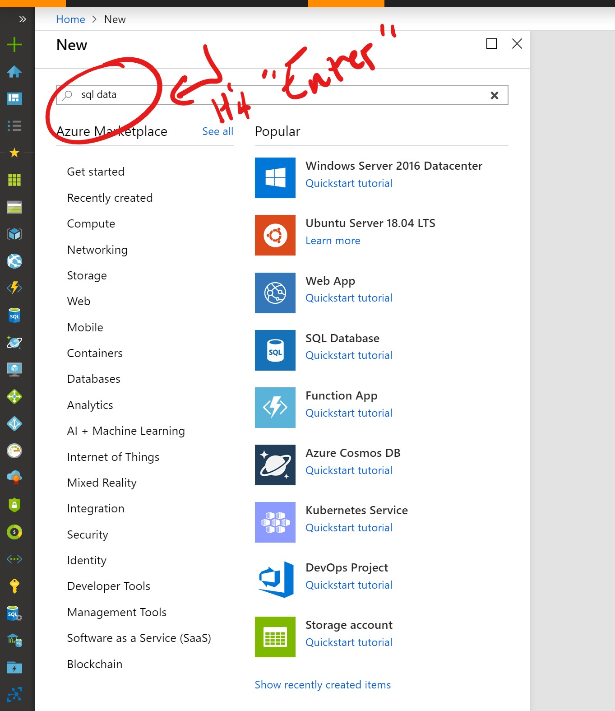
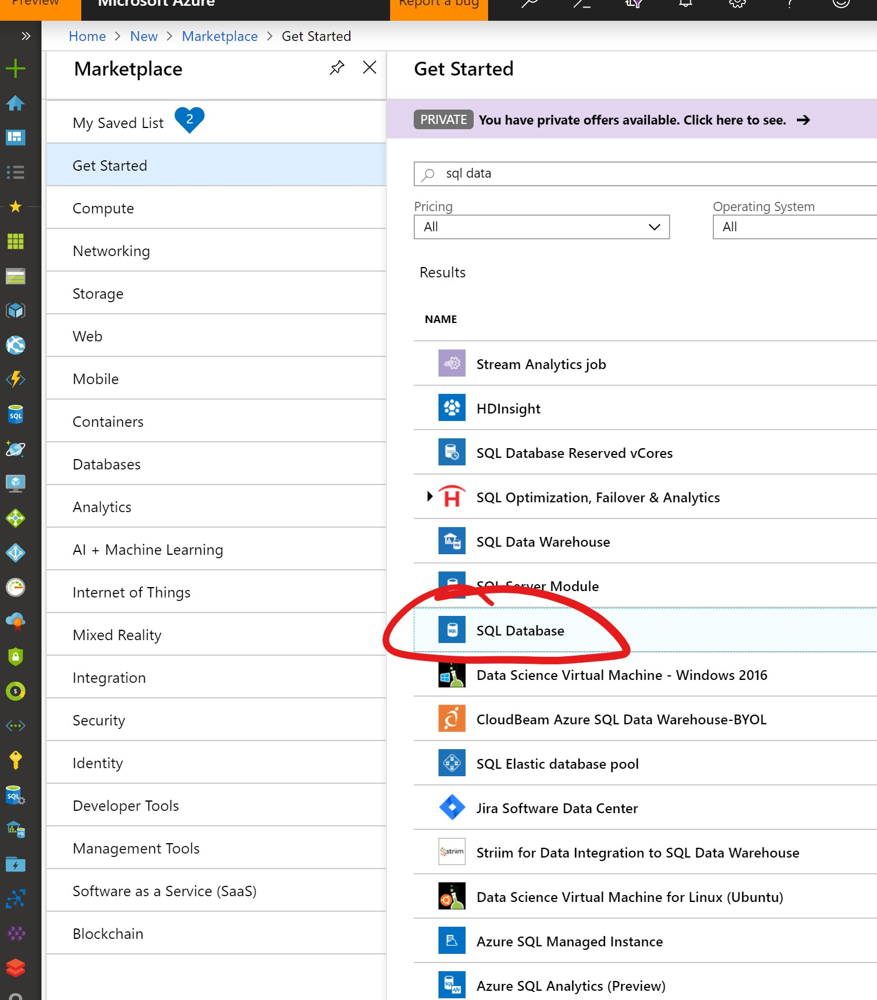
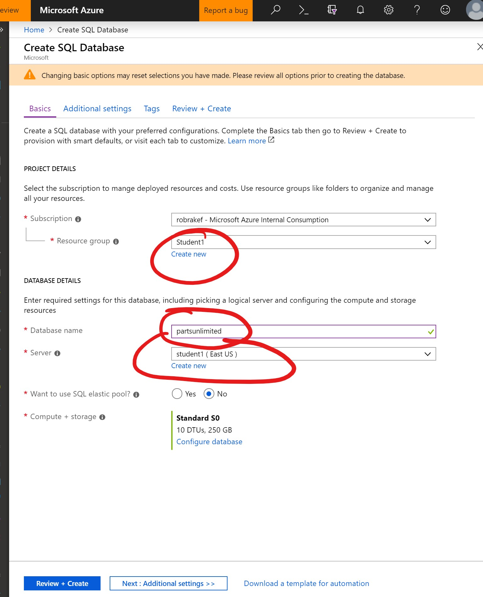
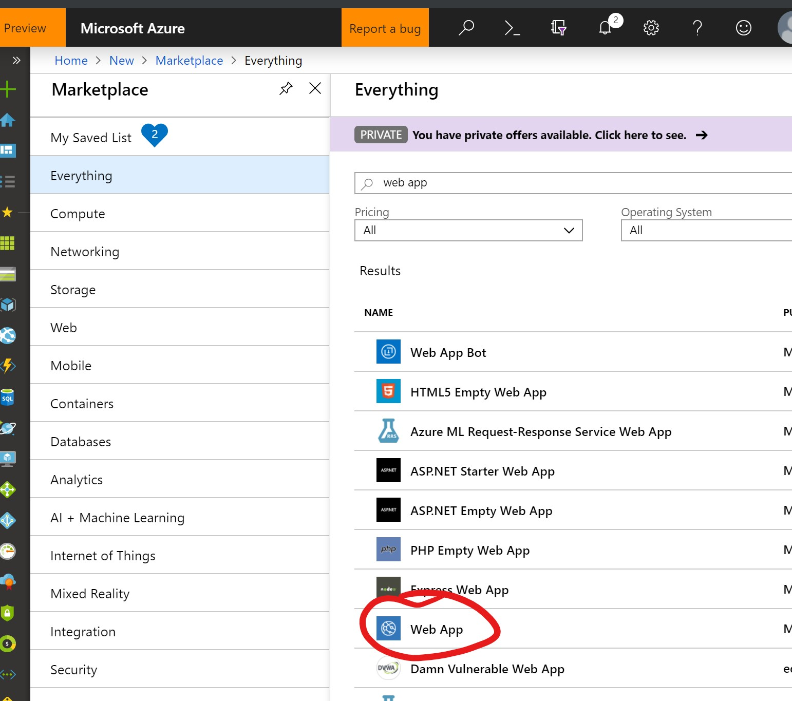
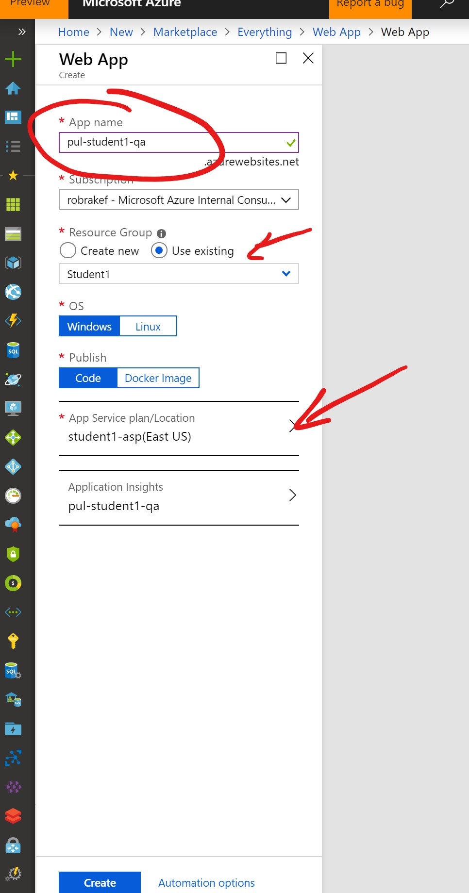
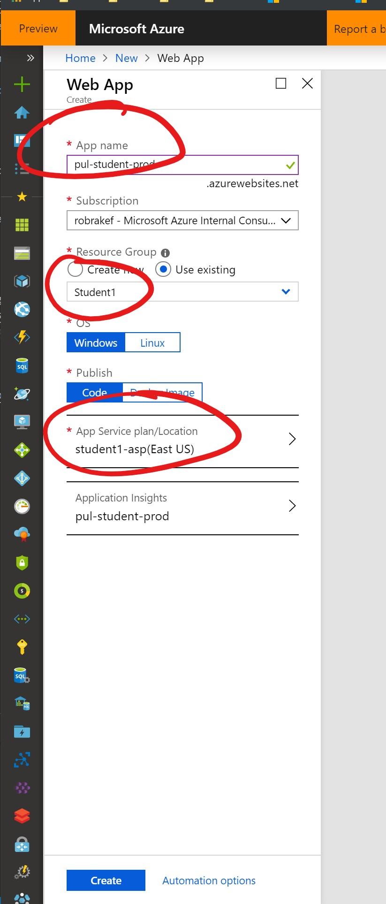

# Azure DevOps Simple CI/CD Pipeline Exercise
## [DevOps Prequisite](https://www.azuredevopslabs.com/labs/azuredevops/prereq/) 
### **Make sure to give your project name something unique like "Joeys-PartsUnlimited"**
  
## Continuous Integration (CI) Pipeline Exercise
[Exercise A: Configure a CI Pipeline](https://www.azuredevopslabs.com/labs/azuredevops/continuousintegration/)

## Continuous Deployment (CD) Pipeline Exercise
[START HERE --> Exercise B: Configure a CD Pipeline](https://www.azuredevopslabs.com/labs/azuredevops/continuousdeployment/)
- In the first part of this exercise, we create an Azure SQL database. This should be very familiar since we just did this in Exercise 3. Please follow the directions below not the one referenced in the material to create your Azure SQL DB called "partsunlmited" in **Step 4**.
- Also in **Step 4**, you are advised to create a logical SQL Server instance like you did in [Exercise 3: Step 3](https://docs.microsoft.com/en-us/learn/modules/provision-azure-sql-db/3-create-your-database). This is unnecessary. Please use the same SQL server instance your created in Exercise 3 instead of creating a new one as the directions suggest.
  ### Walkthrough to provision the database since the UI has changed a bit since the DevOps lab documentation was published:
    - Click the **New aka the "+" icon in the top of the portal**. Type in **sql data** and you'll get a list of Azure SQL options.

    

    - Next, select **SQL Database** as your option and then click **Create**.

    

    - Now, it's time to input your options for your new Azure SQL DB.
  
    

    - Lastly, click **Review + Create** --> **Create**

#### Continue on with Step 7 Below: Creating the Azure Web app

### Walkthrough to provision the Web App since the UI has changed and we want to leverage the work you did in [Exercise 2](https://docs.microsoft.com/en-us/learn/modules/host-a-web-app-with-azure-app-service/).
  - Click the **New aka the "+" icon in the top of the portal**. Type in **web app** and you'll get a list of Web app options. Next, select **Web App** and **Create**
  
  

  - Next, fill in the parameters for the new Web App.

  

  - Do it again for the "prod" variant of the Web App.

#### Continue on with Task 2: Creating a continuous release on the QA stage

    
# Craving More DevOps?
- [Optional Exercise for DevOps Test Plans on a Website](https://docs.microsoft.com/en-us/learn/modules/load-test-web-app-azure-devops/)
- [DevOps Labs Links](https://www.azuredevopslabs.com/)